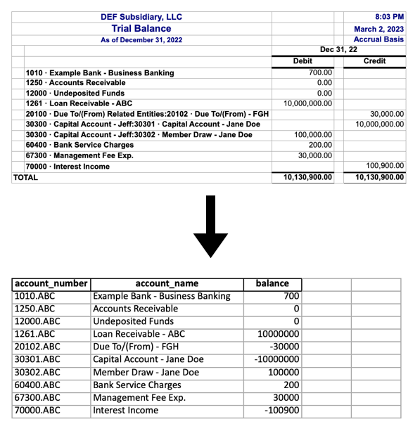

# Python-for-CPAs

A collection of jupyter notebooks that illustrate scalable extract transform load workflows for accountants. Building on the idea that coding is not just for software engineers, this project is meant to show that ETL scripts are not just for data engineers! Anyone who regularly receives data in a given (often messy) format and needs to perform some kinds of transformations on that data to make it useful could benefit from learning to clean data with python.

### 1) [Trial Balance: From QuickBooks to CCH Engagement](https://github.com/jacxson/Trial-Balance-Formatting)

### 2) Lease Accounting: From Lease Schedules to LeaseCrunch (Coming Soon!)
