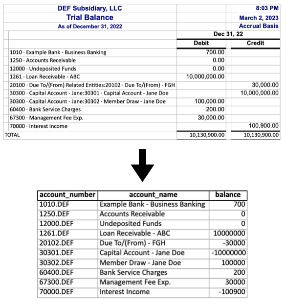

# Python-for-CPAs

A collection of jupyter notebooks that illustrate scalable extract transform load workflows for accountants. Building on the idea that coding is not just for software engineers, this project is meant to show that ETL scripts are not just for data engineers! Anyone who regularly receives data in a given (often messy) format and needs to perform some kinds of transformations on that data to make it useful could benefit from learning to clean data with python.

### 1) [Trial Balance: From QuickBooks to CCH Engagement](https://github.com/jacxson/Trial-Balance-Formatting)

Formatting trial balance data from quickbooks exports to import into CCH Engagement can be tedious work, especially for clients with multiple subsidiaries. While it is manageable for companies with 3 or 4 subsidiaries to handle this work in excel, what if there are dozens of them? And what if each entity has hundreds of accounts? This project was inspired by a real world scenario working in an audit and assurance practice where I was asked to format the trial balances for a company with 75 subsidiaries. I decided it was time to put together a scalable ETL workflow for trial balance data. The notebooks in this project assume some basic knowledge of python inlcuding data types, control flow, and functions, and the pandas library. If you would like to jump straight into the code, check out the [example notebook](tb_formatting_example.ipynb) or the corresponding [etl script](tb_formatting_etl.py) (the two are essentially identical). If you would like a more step by step guide that lays out how I arrived at the code in those files, check out the [tutorial notebook](tutorial_notebook_tb_formatting.ipynb). If the code in these notebooks is a little more advanced than your current knowledge of python, but you are curious to learn more about pythonic approaches to accounting workflows, feel free to reach out on [LinkedIn](linkedin.com/in/jacxson). I'd love to chat!
### 2) Lease Accounting: From Lease Schedules to LeaseCrunch (Coming Soon!)
